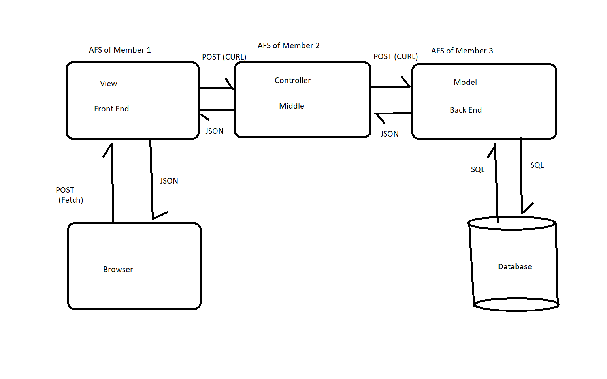

# CS490-Group-Project

<h2>Due Dates:</h2>
<table style="min-width: 100%">
     <tr>
          <th>Sprint</th>
          <th>Planned Due Date</th>
          <th>Actual Due Date</th>
     </tr>
     <tr>
          <th>Skeleton</th>
          <td>Thurs 5/26</td>
          <td> N/A </td>
     </tr>
     <tr>
          <th>Alpha</th>
          <td>Sat 5/28</td>
          <td>Thurs 6/2</td>
     </tr>
      <tr>
          <th>Beta</th>
          <td>Wed 6/8</td>
          <td>Thurs 6/9</td>
     </tr>
      <tr>
          <th>Release Candidate</th>
          <td>Wed 6/15</td>
          <td>Thurs 6/16</td>
     </tr>
     <tr>
          <th>FINAL VERSION</th>
          <td>Wed 6/22</td>
          <td>Thurs 6/23</td>
     </tr>
</table>

<h2>Project Architecture:</h2>

